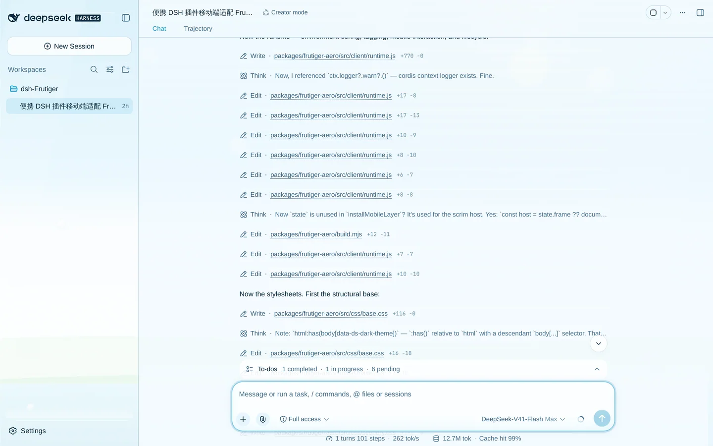
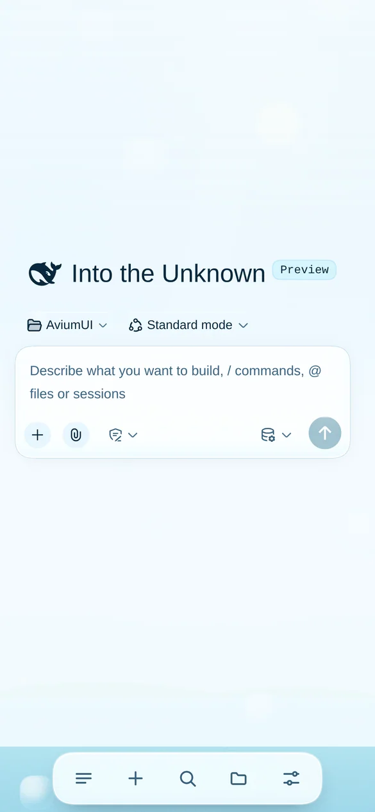
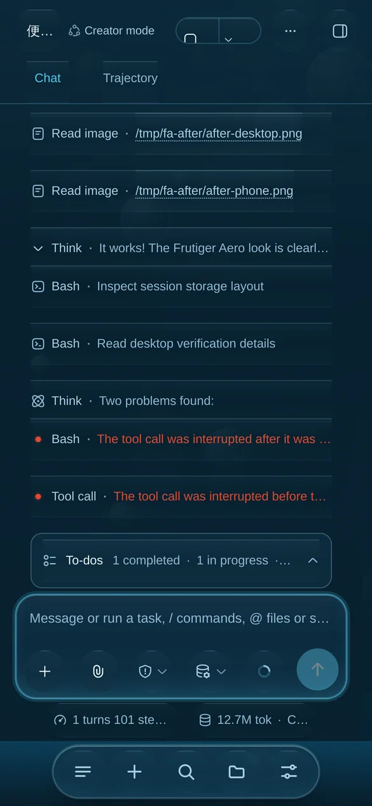
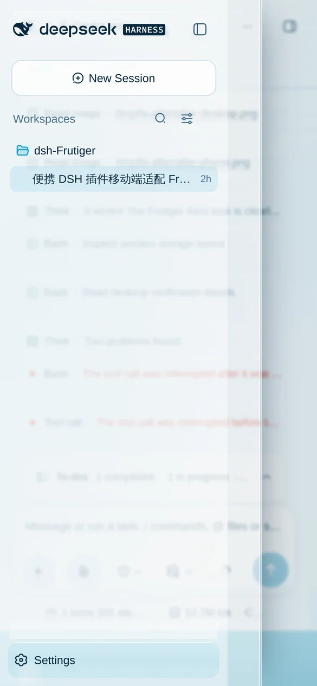
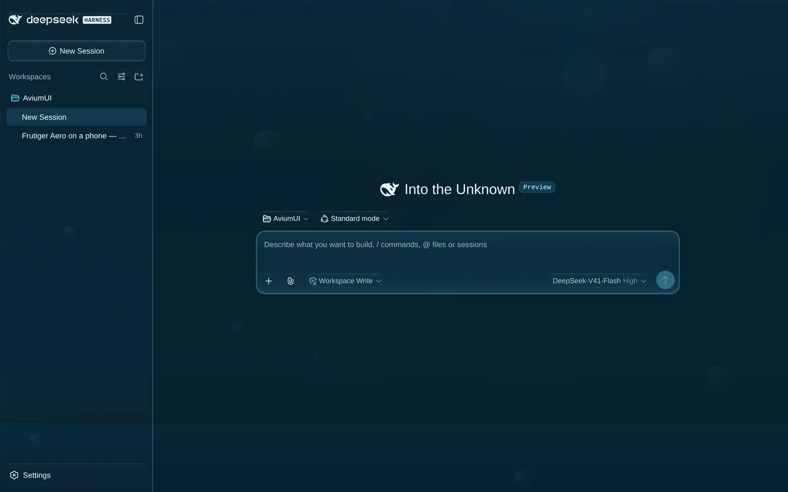
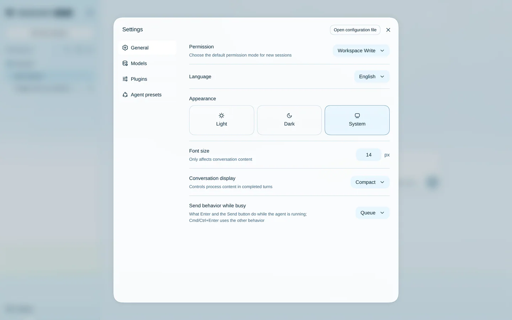
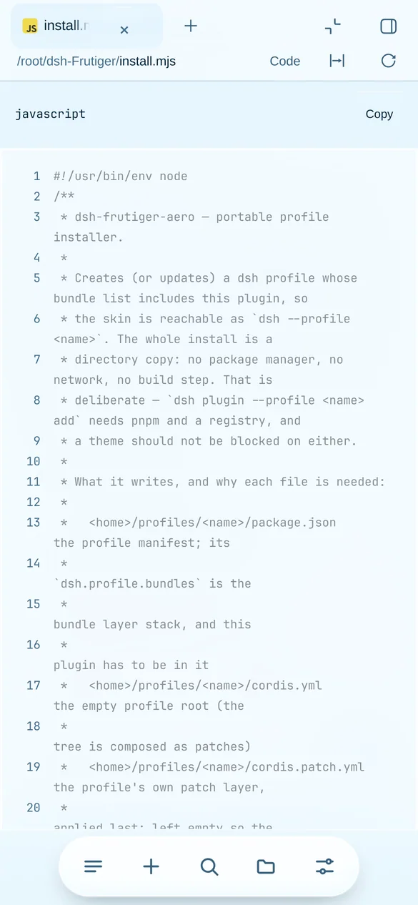

# dsh-frutiger-aero

[English](README.md) | 中文

[](https://www.npmjs.com/package/dsh-frutiger-aero)
[](https://www.npmjs.com/package/dsh-frutiger-aero)
[](LICENSE)
[](https://github.com/topics/dsh-plugin)
[](https://github.com/deepseek-ai/deepseek-harness)
[](https://Hotsteel2901.github.io/dsh-frutiger-aero/)

**DeepSeek Harness 网页界面的 Frutiger Aero 皮肤 —— 玻璃、水、天空与气泡，电脑端和手机端都顺手。**

一个可移植的 `dsh` profile 插件。它通过产品自身的 token 体系给整个 Web 界面换肤，
并且重做了窄屏布局 —— 让手机不再是被压扁的桌面端，而是一个真正的 App。

- 🖥️ **电脑端** —— 三栏布局、拖拽调宽手柄、弹窗、菜单、文字选择、滚轮滚动、键盘输入全部照常。
  这层皮肤只增加材质，不改变行为。
- 📱 **手机端** —— 覆盖式抽屉取代被压窄的正文，拇指区的浮动玻璃 dock，边缘滑动手势，
  感知键盘的输入框，44px 触控目标，完整安全区适配。
- 🎨 **Frutiger Aero** —— 会动的壁纸之上是磨砂玻璃面板，所有可点的东西都有水感高光，
  每条边都有明亮描边；深色方案是深海而不是灰色。
- 🌗 **明暗双主题** —— 每个方案一套调色板，与内置外观切换协作而非打架。
- 📦 **零依赖** —— 浏览器端不 `require` 任何模块。安装就是复制文件；没有构建步骤，
  运行时也不访问网络。

[](docs/assets/shot-desktop-light.webp)

<p align="center">
  
  
  
</p>

---

## 目录

- [安装](#安装)
- [关掉或调低](#关掉或调低)
- [手机端改了什么](#手机端改了什么)
- [电脑端什么都没少](#电脑端什么都没少)
- [实现原理](#实现原理)
- [性能开销](#性能开销)
- [兼容性](#兼容性)
- [常见问题](#常见问题)
- [验证方式](#验证方式)
- [仓库结构](#仓库结构)
- [参与贡献](#参与贡献)
- [许可](#许可)

---

## 安装

三种方式，挑你已经有的那套工具就行。

### 1 · npm 一行命令（推荐）

```sh
dsh plugin --profile web add dsh-frutiger-aero
```

装上最新发布版并注册为 profile bundle 层。刷新网页界面即可生效，全平台通用。
卸载：`dsh plugin --profile web remove dsh-frutiger-aero`。

### 2 · GitHub 安装脚本（不需要 npm 账号，也不需要 git）

**macOS / Linux：**

```sh
curl -fsSL https://raw.githubusercontent.com/Hotsteel2901/dsh-frutiger-aero/main/install.sh | sh
```

**Windows（PowerShell）：**

```powershell
irm https://raw.githubusercontent.com/Hotsteel2901/dsh-frutiger-aero/main/install.ps1 | iex
```

两者都会下载最新发布版，放进目标 profile 的 `node_modules`，并把它加入该 profile 的 bundle 列表。
除了 Node 什么都不需要 —— 不用包管理器、不连 registry、不用构建。
想装到 `frutiger` 以外的 profile：

```sh
curl -fsSL .../install.sh | sh -s -- --profile aero
```

### 3 · 从克隆仓库安装（开发用）

```sh
git clone https://github.com/Hotsteel2901/dsh-frutiger-aero
cd dsh-frutiger-aero
node install.mjs                 # 装进 `--profile frutiger`
node install.mjs --link          # 或改为软链接，重新构建即时生效
```

然后：

```sh
dsh --profile frutiger --port 3099 --no-open
```

打开它打印出来的地址 —— 地址里带一次性 token，浏览器会因此拿到已认证的会话 cookie。

### 安装器参数

| 参数 | 作用 |
| --- | --- |
| `--profile <name>` | 要创建或更新的 profile（默认 `frutiger`） |
| `--home <dir>` | 要操作的 Harness home（默认 `$DSH_HOME`，其次 `~/.dsh`） |
| `--link` | 用软链接代替复制 —— 方便改插件本身 |
| `--print` | 只解析、不写任何文件 |
| `--uninstall` | 删除包与 bundle 条目，保留 profile 及其会话 |
| `--json` | 输出机器可读结果 |

---

## 关掉或调低

**按浏览器调，不动安装。** 插件暴露了一个小的控制面：

```js
window.__FRUTIGER__.setEffects('lite')   // 'full' | 'lite' | 'off'
window.__FRUTIGER__.setScene(false)      // 只关壁纸
window.__FRUTIGER__.tier()               // 当前生效档位
```

或者直接用地址栏参数：

```
http://127.0.0.1:3099/?frutiger=off       # 完全不要装饰
http://127.0.0.1:3099/?frutiger=lite      # 保留配色与布局，关模糊，10 个气泡
http://127.0.0.1:3099/?frutiger=full      # 强制最高档，跳过帧率治理
```

地址参数是在 token 校验**之后**读取的，所以请收藏干净的地址，
而不是 `dsh` 打印出来的那一条。

**只禁用这一行，保留安装。** 在 `<profile>/cordis.patch.yml` 里：

```yaml
- id: frutiger-aero
  disabled: true
```

profile 的 patch 文件是实时重载的，不需要重启。

**彻底移除。** `node install.mjs --uninstall`，或
`dsh plugin --profile web remove dsh-frutiger-aero`。profile 和会话都会保留。

---

## 手机端改了什么

原生窄屏布局是**挤压式**的：窄于 1024px 时侧栏仍占着网格轨道，
于是 390px 手机上图标栏拿 56px，正在读的内容只剩 334px —— 而且抽屉一打开，
聊天记录只剩 **108px** 宽。这个插件改的是布局本身，不只是涂装。

| | ≥ 1024px | 641–1023px | ≤ 640px |
| --- | --- | --- | --- |
| 布局 | 原生三栏 | 单栏，侧栏覆盖在内容之上 | 单栏，图标栏移出画布 |
| 导航 | 侧栏 | 56px 图标栏 + 覆盖式抽屉 | 底部浮动 dock |
| 阅读宽度 | 产品默认 | 整列，上限 680px | 整列 |

在此之上还有：

- **覆盖式抽屉**从内容上方滑出，遮罩可点击关闭，并吃掉本该滚到背后页面的那一下触摸。
- **边缘滑动手势** —— 从左边缘滑开、向左滑关；一旦判定为竖向意图，手势立刻交还给滚动容器。
- **底部 dock** 的按钮通过无障碍名称去点击产品自己的控件，不重复实现任何逻辑；
  对应控件不存在时按钮直接不渲染。
- **感知键盘的输入框** —— 用 `visualViewport` 把被遮挡的高度发布成自定义属性，
  在布局视口不缩放的 iOS 上把输入框精确抬起那么多。
- **触屏人体工学** —— 粗指针下 44px 触控目标（密集工具栏保留 36px 下限，
  因为强行 44px 会把整条工具栏挤变形）、16px 输入下限（治 iOS 聚焦缩放）、
  `touch-action: manipulation`、惯性滚动、overscroll 收敛、去掉点击高亮、按下轻震动。
- **安全区适配** —— `viewport-fit=cover` 配合抽屉、dock、输入框上的
  `env(safe-area-inset-*)`，并用 `100dvh` 取代 `100vh`。

另外修掉了两个**产品级缺陷**（而不是绕开），因为不修的话，皮肤只是在给一个坏掉的界面换皮：

1. 那条把聊天记录挤到 108px 的 56px 轨道；
2. 会话把阅读宽度写成 `clamp(680px, …)` —— **680px 下限比手机还宽**，
   会把每一轮消息裁成左边一条。

手机上的全屏右侧面板（文件预览、diff）会保留 dock —— 阅读时切换会话仍然有用 ——
但面板会在 dock 之上收边，文件最后几行不会被浮动条挡住。

---

## 电脑端什么都没少

什么都没少，这层皮肤是纯增量的：

- 三栏布局、列宽拖拽手柄、侧栏折叠/展开；
- 弹窗、菜单、浮层、提示、toast（只是换了材质，没有新行为）；
- 文字选择、滚轮滚动、键盘导航、焦点环；
- 产品自己的明暗切换、字号设置以及其他所有偏好项。

`interact.mjs` 每次运行都会断言这些 —— 见[验证方式](#验证方式)。

[](docs/assets/shot-desktop-dark.webp)

<details>
<summary>设置弹窗与手机端文件预览</summary>

<p align="center">
  
  
</p>

</details>

---

## 实现原理

### 它是插件，而且按插件的方式做事

bundle patch 只插入一行，宿主端是一个空的 `apply()`。这一行存在的意义在于它的**清单声明**：
`dsh.client` 让 `@deepseek-ai/dsh-client-modules` 把 `lib/client.js` 作为浏览器插件
编进 `window.__DSH_BOOT__`。宿主端什么都没加 —— 没有服务、没有工具、没有配置、不碰会话状态。

浏览器端只负责绘制。它装的每一个钩子，要么是样式表，要么是自己创建的节点，
要么是被动监听器，要么是产品自己节点上的属性；每一项都通过 `ctx.effect` 释放。
把这一行设为 `disabled: true` 就完全恢复原样。

### 配色：换的是 token 图谱，不是组件

产品的颜色分两层 —— `--dsw-static-*` 原始色阶和 `--dsw-alias-*` 语义角色 ——
所有表面、边框和文字都走语义层。覆盖语义层就一次性给整个应用换色，
不需要写任何组件级规则；而且因为 `ui-layout` 正是把这些 alias 值写到 `<body>` 上，
它也是唯一能和内置明暗切换**协作**而不是打架的层。

调色板故意写两遍：

- 一遍是挂在 `body[data-ds-dark-theme]` 上的 `!important` 样式表 ——
  级联里唯一能压过内联自定义属性的东西，这样皮肤永远不会因为加载顺序的意外而输掉优先级；
- 一遍走 `theme.overrideTokens()`，让运行时快照、`theme-color` 元数据和外观预览方块
  与实际画面保持一致。

`src/client/palette.js` 是这两者的唯一真相源。原始色阶两边共用；
只有语义别名按方案区分，因为 Aero 是一种**明亮**材质（明亮天空之上的玻璃），
而它的夜间形态是一种**幽暗**材质（深海之上的生物光）。

### 结构：用产品自己的语义词汇

CSS-module 的类名是按构建哈希的（`.pI_x6G_sidebarCol`），拿它当选择器根本活不过一次升级。
产品真正稳定的是它自己样式和测试都依赖的语义化 `data-*` 词汇。
这层皮肤就是照着它写的 —— `[data-rightbar-col]`、`[data-shell-overlay]`、
`[data-conversation-scroll]`、`[data-composer-card]`、`[data-chat-flow-kind]`、
`[data-files-row]` —— 再加上 ARIA role 与元素语义。

剩下的靠一个 rAF 合并的小标注器补齐：它以 `[data-rightbar-col]` 的父节点作为 frame，
给每一列打上 `data-fa-col`，并从聊天记录往上找到第一个真正画了背景的祖先作为画布。
它只监听 `childList` 和三个表现属性，不监听消息列表，也永远不会看到自己写的属性。

### 壁纸

九层图层装在一个 `contain: strict` 的 fixed 元素里，
所以它不参与布局、不能被滚动、也永远不会出现在命中测试里。两条规则让它足够便宜：

1. 只动 `transform` 和 `opacity` —— 合成器能不唤醒主线程就完成动画的两个属性；
2. `backdrop-filter` 背后不放动画。场景由大面积羽化渐变构成 ——
   本身就是模糊会得到的样子 —— 所以气泡移动时不会有任何滤镜被重算。

整个插件里没有任何 rAF 循环，也没有 `will-change` 提示：
22 个被提升的图层比壁纸本身还贵，而带动画的 transform 引擎自己就会提升。

---

## 性能开销

在一个不属于自己的应用里加动效，只有在开销有上限时才站得住脚，所以插件运行一套档位治理。

| 档位 | 触发条件 | 壁纸 | 模糊 | 动画 |
| --- | --- | --- | --- | --- |
| `full` | 精细指针、≥ 3 核、≥ 4 GB | 22 气泡、焦散、光束、颗粒 | 开 | 全部 |
| `lite` | 粗指针或小屏、≤ 4 核、≤ 3 GB、省流量、减少动效 | 10 气泡 | 关 | 仅入场 |
| `off` | 显式 `?frutiger=off` | 无 | 关 | 无 |

分级只读取零成本信号（`pointer`、`hardwareConcurrency`、`deviceMemory`、`saveData`、
`prefers-reduced-motion`）；随后插件会在启动后采样约一秒真实帧率，不一致就**只降一次** ——
治理只会往下走，所以恢复性能的设备不会在「华丽」和「朴素」之间来回抖。
显式指定档位会完全关闭治理：用户要 `full`，那就是 `full`。

整个设计里唯一真正昂贵的是 `backdrop-filter`，它被门控两次：
低于 `full` 关掉，以及只用在比视口小的面板上。第二道门控是关键 ——
早期版本把它加在右侧**列**上，那一列在桌面是零宽轨道，但一旦框架塌成单列就铺满整个屏幕，
于是在手机上它把整个应用都模糊并降饱和了。

`prefers-reduced-motion` 被理解为「不要动」，而不是「不要主题」：壁纸留着，冻住。
标签页切到后台，一切暂停。

---

## 兼容性

- **界面：** dsh Web UI（`dsh --profile web`，或任何基于 `@deepseek-ai/dsh-base` +
  `@deepseek-ai/dsh-web-app` 构建的 profile）。内嵌 dsh Web UI 的桌面客户端会得到同一层皮肤，
  因为插件针对的是产品的 token 与钩子，而不是某一个客户端的 DOM。
- **Node：** 跟随 dsh 安装本身的要求，插件不额外提要求。
- **浏览器：** 任何当前版本的 Chromium、Firefox、WebKit。
  `backdrop-filter`、`:has()`、`dvh` 都是优雅降级而不是直接坏掉 ——
  `lite` 档存在的意义就是让负担不起玻璃的设备仍然拿到配色与布局。
- **其他插件：** 任何基于 `--dsw-*` token 的界面都会跟着一起换色。
  但如果某个插件把颜色写死，或者在整屏上铺 `backdrop-filter`，仍可能冲突 ——
  这是真实存在的限制，不是假设。

---

## 常见问题

<details>
<summary>会不会弄坏应用，或者污染主题之外的东西？</summary>

宿主端是空的 `apply()` —— 没有服务、没有工具、不碰会话状态。浏览器端只负责绘制。
每个副作用都通过 `ctx.effect` 释放，禁用这一行即可完全恢复原样。

</details>

<details>
<summary>怎么完全恢复原生界面？</summary>

`node install.mjs --uninstall`，或在 profile 的 `cordis.patch.yml` 里写
`- id: frutiger-aero` 加 `disabled: true`。两种方式都会保留 profile、会话和设置。

</details>

<details>
<summary>为什么手机端要动布局，而不只是换颜色？</summary>

因为原生窄屏布局坏在颜色修不了的地方：390px 手机上聊天记录只有 108px 宽。
对这一点视而不见的皮肤，只是给一个坏掉的界面换了层皮。

</details>

<details>
<summary>会不会拖慢机器？</summary>

看上面的档位表。简短版：`full` 档有模糊输入框、模糊弹窗和 22 个气泡的壁纸，
全部只走合成器；`lite` 档拿到配色和布局，完全不用滤镜。
屏幕外和后台标签页里没有任何动画在跑。

</details>

<details>
<summary>不 fork 能改配色吗？</summary>

目前还没有设置界面。`src/client/palette.js` 是唯一真相源，
`node build.mjs` 从它同时生成样式表和主题服务覆盖。加一个设置行是合理的下一步 ——
见 [CHANGELOG.md](CHANGELOG.md)。

</details>

---

## 验证方式

`.devtools/` 用 Playwright 驱动真实页面。它不是交付物的一部分，安装时完全用不到，
但这份文档里的每一条结论都是用它量出来的。

| 脚本 | 回答什么问题 |
| --- | --- |
| `interact.mjs` | **真实输入** —— CDP 触摸滑动、点击、键入、滚轮、拖拽、选择：每次运行 29 条断言，两种语言各跑一遍 |
| `docktest.mjs` | 手机端底栏在中文与英文下：每次 24 条断言 |
| `trajcheck.mjs` | 轨迹界面在手机端与电脑端：11 条断言 |
| `settingscheck.mjs` | 从底栏打开设置：两种语言、手机与电脑端，23 条断言 |
| `aligndiff.mjs` | 与原生 profile 对比，找出**由皮肤引入**的控件错位 |
| `final.mjs` | 各视口下的布局、抽屉、dock、计算样式、控制台报错与截图 |
| `tiers.mjs` | 同一页面在 `full` / `lite` / `off` 三档下、各视口的表现 |
| `lum.mjs` | 渲染对比度测量，用来找只存在于像素里的问题 |
| `landing.mjs` | GitHub Pages 落地页：桌面、移动端、减少动效下共 19 条检查 |
| `hit.mjs` | 视口各点上的点击究竟落在哪个元素上 |

用例覆盖桌面、笔记本、平板、手机竖屏、小屏手机与手机横屏，明暗两套方案，全部档位。
当前状态：**交互 29/29**（两种语言各一遍）、**底栏 24/24**、**轨迹 11/11**、**落地页 19/19**，控制台全程干净。

---

## 仓库结构

```
install.mjs                  可移植的 profile 安装/卸载器
install.sh, install.ps1      GitHub 一行安装脚本（无需 npm 账号）
packages/frutiger-aero/      插件本体 —— 发布到 npm 的就是它
  package.json               dsh.bundle + dsh.client 声明
  cordis.patch.yml           这个 bundle 插入的唯一一行
  build.mjs                  把 src/css/*.css 内联进 lib/client.js
  src/host.js                宿主端（故意留空）
  src/client/palette.js      整套配色，唯一真相源
  src/client/scenery.js      壁纸的 DOM，种子化且可复现
  src/client/runtime.js      分级、标注、移动层、dock、控制面
  src/css/*.css              base、scenery、material、mobile、effects
  lib/                       构建产物（已提交 —— 安装无需构建）
docs/                        GitHub Pages 落地页
submission/                  可直接提 PR 的收录条目
.devtools/                   验证工具链
```

改了 `src/` 下任何东西之后，重新构建浏览器端：

```sh
node packages/frutiger-aero/build.mjs
```

---

## 参与贡献

欢迎提 issue 和 PR —— 见 [CONTRIBUTING.md](CONTRIBUTING.md)。简短版：
先读[实现原理](#实现原理)，守住两条规则（只绘制；每个副作用都通过 `ctx.effect` 释放），
动了移动层就在开 PR 前跑一遍 `interact.mjs`。

## 许可

MIT —— 见 [LICENSE](LICENSE)。

非官方社区插件，与 DeepSeek 无隶属或背书关系。
